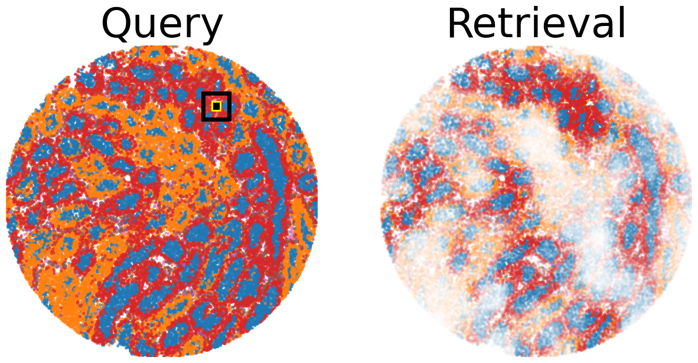
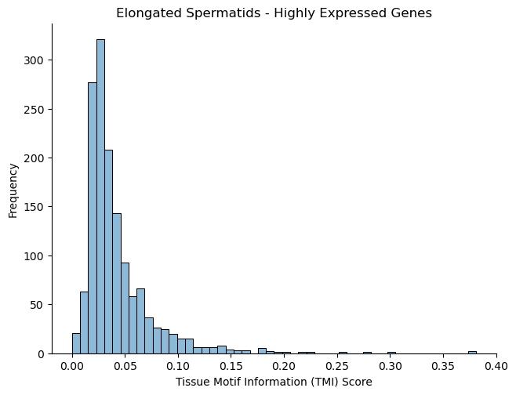
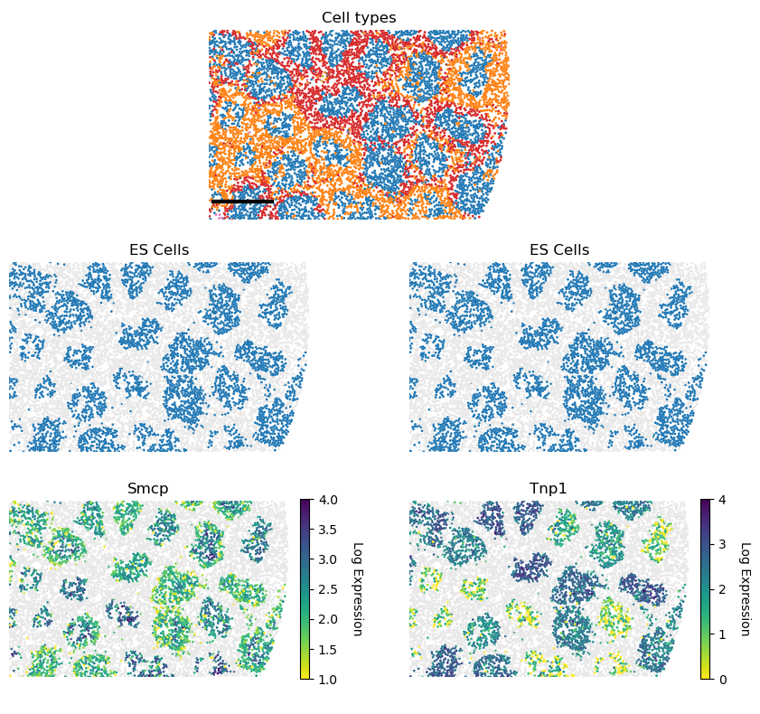
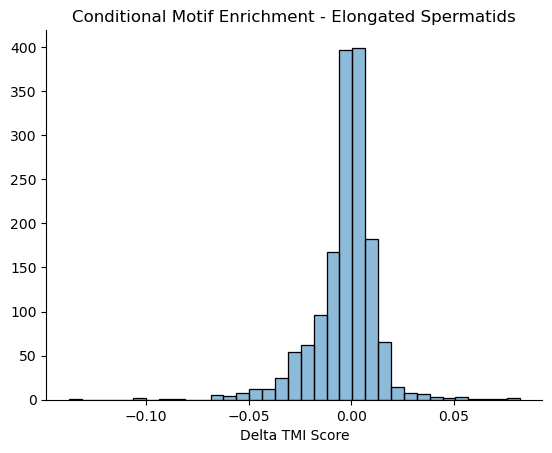

Tutorial to run TissueMosaic on example Testis Slide-seqV2 dataset
~~~~~~~~~~~~~~~~~~~~~~~~~~~~~~~~~~~~~~~~~~~~~~~~~~~~~~~~~~~~~~~~~~

This tutorial guides you through running the main modules of
TissueMosaic for training a model, featurizing the anndata, regressing
gene expression, and performing conditional motif enrichment.

First download the example testis anndata files and config training file
from…TODO

Train model
^^^^^^^^^^^

Next, navigate to the “tissue_purifier/run” directory and run the
following command in the console to train a TissueMosaic model:

.. code:: ipython3

    python main_1_train_ssl.py --config config_dino_ssl.yaml --data_folder ./tutorial/testis_anndata --ckpt_out ./tutorial/testis_dino.pt

After successful completion of the script, you should have a trained
model checkpoint file ‘dino_testis.pt’.

Featurize anndata
^^^^^^^^^^^^^^^^^

Next, create an output directory:

.. code:: ipython3

    mkdir ./tutorial/testis_anndata_featurized

and use the trained model to featurize the testis anndata files with the
following command:

.. code:: ipython3

    python main_2_featurize.py\
        --anndata_in ./tutorial/testis_anndata\
        --anndata_out ./tutorial/testis_anndata_featurized\
        --ckpt_in ./tutorial/testis_dino.pt\
        --feature_key dino\
        --ncv_k 10 25 100\
        --suffix featurized

Motif Query / Clustering
~~~~~~~~~~~~~~~~~~~~~~~~

The model embeddings can be used to perform tasks such as motif query
and clustering, which we demonstrate here:

.. code:: ipython3

    ## import dependencies
    
    from matplotlib import pyplot as plt
    import matplotlib.gridspec as gridspec
    import matplotlib.patches as patches
    from matplotlib.collections import PatchCollection
    from matplotlib_scalebar.scalebar import ScaleBar 
    
    from typing import Tuple, Any, List, Union
    import numpy as np
    import os
    from anndata import read_h5ad
    import pandas as pd
    import umap
    import scanpy as sc
    import random
    import seaborn as sns
    import pickle
    from mpl_toolkits.axes_grid1.anchored_artists import AnchoredSizeBar
    import warnings
    import gseapy as gp
    
    # tissue_purifier import
    import tissue_purifier as tp
    from tissue_purifier.utils.embedding_util import motif_query
    from tissue_purifier.utils.embedding_util import cluster
    from tissue_purifier.utils.embedding_util import conditional_motif_enrichment
    from tissue_purifier.utils.anndata_util import merge_anndatas_inner_join
    from tissue_purifier.plots.plot_misc import scatter

.. code:: ipython3

    ## set seeds
    r_seed=n_seed=100
    
    random.seed(r_seed)
    np.random.seed(n_seed)
    

.. code:: ipython3

    ## set this to the run directory
    os.chdir(os.path.abspath("../run/"))

.. code:: ipython3

    ### Read in anndatas
    
    anndata_dest_folder = './tutorial/testis_anndata_featurized'
    # Make a list of all the h5ad files in the annotated_anndata_dest_folder
    fname_list = []
    for f in os.listdir(anndata_dest_folder):
        if f.endswith('.h5ad'):
            fname_list.append(f)
    print(fname_list)
    
    anndata_list = []
    
    for i, fname in enumerate(fname_list):
        adata = read_h5ad(os.path.join(anndata_dest_folder, fname))
        ## add in external condition
        adata.obs['sample_id'] = i * np.ones(adata.shape[0])
        if 'wt' in fname:
            adata.obs['classify_condition'] = np.repeat(0, adata.shape[0])
        else:
            adata.obs['classify_condition'] = np.repeat(1, adata.shape[0])
        anndata_list.append(adata)

.. parsed-literal::

    ['diabetes2_dm_featurized.h5ad', 'diabetes1_dm_featurized.h5ad', 'wt1_dm_featurized.h5ad', 'wt3_dm_featurized.h5ad', 'wt2_dm_featurized.h5ad', 'diabetes3_dm_featurized.h5ad']

.. code:: ipython3

    ## merge all featurized anndatas
    adata_merged = merge_anndatas_inner_join(anndata_list)

.. parsed-literal::

    /home/skambha6/miniforge3/envs/tissue_purifier/lib/python3.11/site-packages/anndata/_core/anndata.py:1818: UserWarning: Observation names are not unique. To make them unique, call `.obs_names_make_unique`.
      utils.warn_names_duplicates("obs")

.. code:: ipython3

    ## Perform motif query
    
    ref_sample_id = np.where(np.array(fname_list) == 'wt3_dm_featurized.h5ad')[0][0]
    
    query_sample_id = np.where(np.array(fname_list) == 'wt3_dm_featurized.h5ad')[0][0]
    
    adata_ref = anndata_list[ref_sample_id]
    adata_query = anndata_list[query_sample_id]
    
    ## Compute similarity of query patch to all patches in reference sample
    rep_key = 'dino'
    dist_type = 'cosine'
    
    adata_ref_query = motif_query(adata_ref, adata_query, query_point=(3900., 1700.), rep_key=rep_key, dist_type=dist_type)

.. parsed-literal::

    /home/skambha6/chenlab/tissue_purifier/tissue_purifier_sk/src/tissue_purifier/utils/embedding_util.py:37: RuntimeWarning: invalid value encountered in divide
      elif dist_type == 'cosine':

.. code:: ipython3

    ## Plot query patch and retrieval from  reference sample
    # assign color to cell type
    colors = sns.color_palette("tab10", 10).as_hex()
    cdict = {
        'ES': colors[0],
        'RS': colors[1],
        'Myoid': colors[2],
        'SPC': colors[3],
        'SPG': colors[4],
        'Sertoli': colors[5],
        'Leydig': colors[6],
        'Endothelial': colors[7],
        'Macrophage': colors[8]
    }
    
    ## Highlight query patch in query sample
    highlight_list = [
        (3900., 1700., 'yellow')
    ]
    
    # Create a figure
    fig = plt.figure(figsize=(15,15))
    
    # Plot Query
    gs = gridspec.GridSpec(1, 2, hspace=0.0)
    ax1 = fig.add_subplot(gs[0, 0])
    
    scatter(adata_query, 'cell_type', x_key='y', y_key='x', mode='categorical', cdict=cdict, fig=fig, ax=ax1, ticks_off=True, show_legend=False, alpha=0.7, rasterized=True)
    ax1.set_facecolor('white')
    x_query, y_query, highlight_color = highlight_list[0]
    patch_size = 128
    rect = patches.Rectangle(
        (x_query - patch_size / 2, y_query - patch_size / 2),
        patch_size, patch_size,
        linewidth=2, edgecolor=highlight_color, facecolor='black')
    ax1.add_patch(rect)
    
    patch_size = 384
    rect = patches.Rectangle(
        (x_query - patch_size / 2, y_query - patch_size / 2),
        patch_size, patch_size,
        linewidth=5, edgecolor='black', facecolor='none')
    ax1.add_patch(rect)
    ax1.set_title('Query', fontsize=50)
    
    # Plot retrieval
    ax2 = fig.add_subplot(gs[0, 1])
    scatter(adata_ref_query, 'cell_type', alpha_key='sim', x_key='y', y_key='x', mode='categorical', cdict=cdict, ticks_off=True, fig=fig, ax=ax2, show_legend=False, linewidth=0, rasterized=True)
    ax2.set_title('Retrieval', fontsize=50)

.. parsed-literal::

    Text(0.5, 1.0, 'Retrieval')

.. code:: ipython3

    ## Perform spatial clustering on the learned TissueMosaic representations
    
    ## note: this step can take a while to run depending on dataset size and n_neighbors
    # adata_clustered = cluster(adata=adata_merged,
    #                             key='dino',
    #                             n_neighbors=1000, ## increasing n_neighbors gives more stable representations at increased computational cost
    #                             leiden_res=[0.05, 0.1, 0.2, 0.3])
    
    ## use the coarser patch representations and sparse image functionality for computational efficiency
    
    ## To be implemented

Gene Regression
~~~~~~~~~~~~~~~

We can regress gene expression in elongated spermatid cells from the
learned TissueMosaic representations by running the following commands
in the console:

.. code:: ipython3

    #set environment threads
    export OMP_NUM_THREADS=1
    export MKL_NUM_THREADS=1
    export OPENBLAS_NUM_THREADS=1
    export NUMEXPR_NUM_THREADS=1

.. code:: ipython3

    # make output directory
    mkdir ./tutorial/gr_results

.. code:: ipython3

    python main_3_gene_regression.py\
        --anndata_in ./tutorial/testis_anndata_featurized\
        --out_dir ./tutorial/gr_results\
        --out_prefix dino_ctype\
        --feature_key dino_spot_features\
        --alpha_regularization_strength 0.01\
        --filter_feature 2.0\
        --fc_bc_min_umi 500\
        --fg_bc_min_pct_cells_by_counts 10\
        --cell_types ES

We can investigate the results

.. code:: ipython3

    ## Plot distribution of tissue motif information scores
    
    cell_type_names = ["Elongated Spermatids"]
    
    results_dir = './tutorial/gr_results'
    
    ctype = "ES"
            
    out_prefix = "dino_ctype"
            
    rel_q_gk_outfile_name = out_prefix + '_' + ctype + f"_df_rel_q_gk_ssl.pickle"
    rel_q_gk_outfile = os.path.join(results_dir, rel_q_gk_outfile_name)
    rel_q_gk = pickle.load(open(rel_q_gk_outfile, 'rb'))
    
    ## flip sign of TMI score
    rel_q_gk = -1 * rel_q_gk
    
    ## discard genes with TMI score < 0 (these are outlier genes whose performance is worse than baseline)
    rel_q_gk = rel_q_gk[rel_q_gk > 0].dropna()
    
    fig, ax = plt.subplots()
    plt.tight_layout()
    sns.histplot(rel_q_gk, bins=50, legend=False)
    plt.ylabel('Frequency')
    plt.xlabel('Tissue Motif Information (TMI) Score')
    ax.tick_params(axis='y')
    ax.tick_params(axis='x')
    ax.spines['top'].set_visible(False)
    ax.spines['right'].set_visible(False)  
    ax.spines['bottom']
    ax.spines['left']
    ax.set_title('Elongated Spermatids - Highly Expressed Genes')
            

.. parsed-literal::

    Text(0.5, 1.0, 'Elongated Spermatids - Highly Expressed Genes')

.. code:: ipython3

    rel_q_gk.sort_values(by=0).tail(n=10)

.. raw:: html

    

    
    <table border="1" class="dataframe">
      <thead>
        <tr style="text-align: right;">
          <th></th>
          <th>0</th>
        </tr>
      </thead>
      <tbody>
        <tr>
          <th>Tex33</th>
          <td>0.184594</td>
        </tr>
        <tr>
          <th>Ccer1</th>
          <td>0.192707</td>
        </tr>
        <tr>
          <th>Rnf151</th>
          <td>0.199231</td>
        </tr>
        <tr>
          <th>4933411K16Rik</th>
          <td>0.217950</td>
        </tr>
        <tr>
          <th>Smcp</th>
          <td>0.223001</td>
        </tr>
        <tr>
          <th>Fam71b</th>
          <td>0.251620</td>
        </tr>
        <tr>
          <th>Prm1</th>
          <td>0.278291</td>
        </tr>
        <tr>
          <th>Prm2</th>
          <td>0.302034</td>
        </tr>
        <tr>
          <th>Tnp2</th>
          <td>0.376735</td>
        </tr>
        <tr>
          <th>Tnp1</th>
          <td>0.381183</td>
        </tr>
      </tbody>
    </table>
    

.. code:: ipython3

    ## Plot genes with high tissue motif information score back in space
    
    ## parameters
    s = 5
    
    i = np.where(np.array(fname_list) == 'wt2_dm_featurized.h5ad')[0][0] #3 ## wt 2
    adata = anndata_list[i].copy()
    
    ## process gex
    adata.obs['cell_type'] = adata.obsm['cell_type_proportions'].idxmax(axis=1)
    sc.pp.normalize_total(adata)
    sc.pp.log1p(adata)
    
    kfold = 1
    
    adata_kfold = adata[adata.obs[f'train_test_fold_{kfold}'] == 1]
    adata_kfold_es = adata_kfold[adata_kfold.obs['cell_type'] == 'ES']
    adata_kfold_nones = adata_kfold[adata_kfold.obs['cell_type'] != 'ES']
    
    fig, axs = plt.subplots(figsize=(10,10))
    axs.axis('off')
    
    # Define the grid layout
    
    gs = gridspec.GridSpec(3, 4, wspace=1.0, hspace=0.0) #, hspace=-0.1)
    
    
    ax1 = fig.add_subplot(gs[0, 1:3])
    # ax1.set_title('Testis', fontsize=labelfontsize, pad=labelpad)
    scatter(adata_kfold, 'cell_type', x_key='x', y_key='y', mode='categorical', fig=fig, ax=ax1, cdict=cdict, s=s, ticks_off=True, show_legend=False,rasterized=True)
    ax1.set_aspect('equal', 'box')
    ax1.axis('off')
    scalebar = AnchoredSizeBar(ax1.transData,
                               461.54, '', 'lower left', 
                               pad=0.1,
                               color='black',
                               frameon=False,
                               size_vertical=20)
    ax1.add_artist(scalebar)
    ax1.set_title('Cell types')
    
    prop_cycle = plt.rcParams['axes.prop_cycle']
    colors = prop_cycle.by_key()['color']
    
    # assign color to cell type
    grey_hex = '#E8E8E8'
    cdict_temp = {
        'ES': colors[0],
        'RS': grey_hex,
        'Myoid': grey_hex,
        'SPC': grey_hex,
        'SPG': grey_hex,
        'Sertoli': grey_hex,
        'Leydig': grey_hex,
        'Endothelial': grey_hex,
        'Macrophage': grey_hex
    }
    
    ax1 = fig.add_subplot(gs[1, :2])
    scatter(adata_kfold, 'cell_type', x_key='x', y_key='y', mode='categorical', fig=fig, ax=ax1, cdict=cdict_temp, s=s, ticks_off=True, show_legend=False,rasterized=True)
    ax1.set_aspect('equal', 'box')
    ax1.axis('off')
    ax1.set_title('ES Cells')
    
    ax1 = fig.add_subplot(gs[1, 2:])
    scatter(adata_kfold, 'cell_type', x_key='x', y_key='y', mode='categorical', fig=fig, ax=ax1, cdict=cdict_temp, s=s, ticks_off=True, show_legend=False,rasterized=True)
    ax1.set_aspect('equal', 'box')
    ax1.axis('off')
    ax1.set_title('ES Cells')
    
    # Second row, first plot
    ax2 = fig.add_subplot(gs[2, :2])
    
    gene = 'Smcp'
    
    x_coord = adata_kfold_es.obs['x']
    y_coord = adata_kfold_es.obs['y']
    UMI = adata_kfold_es.obs['UMI']
    
    gene_adata = adata_kfold_es[:,gene]
    genex = np.squeeze(np.array(gene_adata.X.todense().flatten()))
    
    ax2_sc = ax2.scatter(x_coord, y_coord, c=genex, s = s, marker='h', edgecolors='none', vmin=1, vmax=4, cmap='viridis_r',rasterized=True)
    ax2.set_aspect('equal', 'box')
    ax2.set_xlim((np.min(adata_kfold.obs['x'].values), np.max(adata_kfold.obs['x'].values)))
    ax2.set_ylim((np.min(adata_kfold.obs['y'].values), np.max(adata_kfold.obs['y'].values)))
    ax2.axes.invert_yaxis()
    ax2.set_xticks([])
    ax2.set_yticks([])
    
    scatter(adata_kfold_nones, 'cell_type', x_key='x', y_key='y', mode='categorical', fig=fig, ax=ax2, cdict=cdict_temp, s=s, ticks_off=True, show_legend=False,rasterized=True)
    
    ax2.set_title(gene)
    ax2.spines['top'].set_visible(False)
    ax2.spines['right'].set_visible(False)  
    ax2.spines['bottom'].set_visible(False)  
    ax2.spines['left'].set_visible(False)
    ax2.set_ylabel('Log Expression')  
    ax2.axis('off')
    cbar = plt.colorbar(ax2_sc, ax=ax2, label=None, fraction=0.030, pad=0.04)
    cbar.set_label('Log Expression', rotation=270,labelpad=20)
    cbar.ax.tick_params()
    
    
    gene = 'Tnp1'
    
    kfold = 1
    
    adata_kfold = adata[adata.obs[f'train_test_fold_{kfold}'] == 1]
    adata_kfold_es = adata_kfold[adata_kfold.obs['cell_type'] == 'ES']
    adata_kfold_nones = adata_kfold[adata_kfold.obs['cell_type'] != 'ES']
    
    x_coord = adata_kfold_es.obs['x']
    y_coord = adata_kfold_es.obs['y']
    UMI = adata_kfold_es.obs['UMI']
    
    gene_adata = adata_kfold_es[:,gene]
    genex = np.squeeze(np.array(gene_adata.X.todense().flatten()))
    
    ax3 = fig.add_subplot(gs[2, 2:])
    
    
    ax3_sc = ax3.scatter(x_coord, y_coord, c=genex, s = s, marker='h', edgecolors='none', vmin=0, vmax=4, cmap='viridis_r',rasterized=True)
    ax3.set_aspect('equal', 'box')
    ax3.set_xlim((np.min(adata_kfold.obs['x'].values), np.max(adata_kfold.obs['x'].values)))
    ax3.set_ylim((np.min(adata_kfold.obs['y'].values), np.max(adata_kfold.obs['y'].values)))
    ax3.axes.invert_yaxis()
    ax3.set_xticks([])
    ax3.set_yticks([])
    
    scatter(adata_kfold_nones, 'cell_type', x_key='x', y_key='y', mode='categorical', fig=fig, ax=ax3, cdict=cdict_temp, s=s, ticks_off=True, show_legend=False,rasterized=True)
    
    
    ax3.set_title(gene)
    ax3.spines['top'].set_visible(False)
    ax3.spines['right'].set_visible(False)  
    ax3.spines['bottom'].set_visible(False)  
    ax3.spines['left'].set_visible(False)  
    ax3.axis('off')
    cbar = plt.colorbar(ax3_sc, ax=ax3, label=None, fraction=0.030, pad=0.04)
    cbar.set_label('Log Expression', rotation=270,labelpad=20)
    # cbar.ax.set_yticklabels([0.0, 2.0, 4.0])

Conditional Motif Enrichment
~~~~~~~~~~~~~~~~~~~~~~~~~~~~

.. code:: ipython3

    ## perform conditional motif enrichment
    
    ## Run enrichment on motifs (with all cell types)
    
    warnings.filterwarnings('ignore')
    
    adata_enriched = conditional_motif_enrichment(adata_merged, feature_key="dino_spot_features",
                                                  classify_or_regress="classify", alpha_regularization = [1000.0, 2500.0, 5000.0])
    
    ## can subset anndata to specific cell types to do enrichment in a cell-type specific manner
    ## ex: adata_es_merged = adata_merged[adata_merged.obs['cell_type'] == 'ES']

.. parsed-literal::

    Running kfold 1
    Running kfold 2
    Running kfold 3
    Running kfold 4

.. code:: ipython3

    ## write motif enriched anndatas to file
    
    anndata_enriched_db = adata_enriched[adata_enriched.obs['predicted_condition'] >= 0]
    anndata_enriched_db.write_h5ad('./tutorial/testis_anndata_enriched_db.h5ad')
    
    anndata_enriched_wt = adata_enriched[adata_enriched.obs['predicted_condition'] < 0]
    anndata_enriched_wt.write_h5ad('./tutorial/testis_anndata_enriched_wt.h5ad')

Run GEX regression on enriched anndatas

.. code:: ipython3

    python main_3_gene_regression.py\
        --anndata_in ./tutorial/testis_anndata_enriched_wt.h5ad\
        --out_dir ./tutorial/gr_results\
        --out_prefix dino_enriched_wt_ctype\
        --feature_key dino_spot_features\
        --alpha_regularization_strength 0.01\
        --filter_feature 2.0\
        --fc_bc_min_umi=500\
        --fg_bc_min_pct_cells_by_counts 10\
        --cell_types ES
    
    
    python main_3_gene_regression.py\
        --anndata_in ./tutorial/testis_anndata_enriched_db.h5ad\
        --out_dir ./tutorial/gr_results\
        --out_prefix dino_enriched_db_ctype\
        --feature_key dino_spot_features\
        --alpha_regularization_strength 0.01\
        --filter_feature 2.0\
        --fc_bc_min_umi=500\
        --fg_bc_min_pct_cells_by_counts 10\
        --cell_types ES

.. code:: ipython3

    ## look at delta TMI genes b/w enriched motifs
    
    ctype = "ES"
    
    out_dir = "./tutorial/gr_results"
    
    wt_rel_q_gk_outfile_name = 'dino_enriched_wt_ctype' + '_' + ctype + f"_df_rel_q_gk_ssl.pickle"
    wt_rel_q_gk_outfile = os.path.join(out_dir, wt_rel_q_gk_outfile_name)
    wt_rel_q_gk = pickle.load(open(wt_rel_q_gk_outfile, 'rb'))
    wt_rel_q_gk = -1 * wt_rel_q_gk
    wt_rel_q_gk = wt_rel_q_gk[wt_rel_q_gk > 0]
    
    db_rel_q_gk_outfile_name = 'dino_enriched_db_ctype' + '_' + ctype + f"_df_rel_q_gk_ssl.pickle"
    db_rel_q_gk_outfile = os.path.join(out_dir, db_rel_q_gk_outfile_name)
    db_rel_q_gk = pickle.load(open(db_rel_q_gk_outfile, 'rb'))
    db_rel_q_gk = -1 * db_rel_q_gk
    db_rel_q_gk = db_rel_q_gk[db_rel_q_gk > 0]
    
    
    higher_si_in_db = db_rel_q_gk.sub(wt_rel_q_gk, fill_value=0).dropna()
    
    print('Delta TMI < 0')
    print(higher_si_in_db.sort_values(by=0).head(n=10))
    print('Delta TMI > 0')
    print(higher_si_in_db.sort_values(by=0).tail(n=10))
    
    ax = sns.histplot(higher_si_in_db,bins=35, legend=False)
    plt.ylabel('')
    ax.tick_params(axis='both')  # Adjust labelsize as needed
    ax.spines['top'].set_visible(False)
    ax.spines['right'].set_visible(False)
    ax.set_title('Conditional Motif Enrichment - Elongated Spermatids')
    ax.set_xlabel('Delta TMI Score')

.. parsed-literal::

    Delta TMI < 0
                          0
    Lars2         -0.137719
    Camk1d        -0.104417
    Prss51        -0.100615
    Cmss1         -0.091653
    Pde1c         -0.085228
    Rasa3         -0.065679
    Grin2b        -0.063508
    Nat9          -0.063372
    Noxred1       -0.063292
    1700125H03Rik -0.063064
    Delta TMI > 0
                          0
    mt-Rnr2        0.046020
    Spata18        0.047754
    Gapdhs         0.052634
    Gsg1           0.053069
    Hmgb4          0.055628
    Odf1           0.058060
    Odf2           0.065754
    1700001P01Rik  0.071021
    Tnp1           0.078064
    Tnp2           0.082039

.. parsed-literal::

    Text(0.5, 0, 'Delta TMI Score')

.. code:: ipython3

    ## gene set enrichment analysis on delta TMI scores
    
    pre_res = gp.prerank(rnk=higher_si_in_db, # or rnk = rnk,
                         gene_sets='/home/skambha6/chenlab/utils/m5.go.v2022.1.Mm.symbols.gmt', ## replace with path to your gene set
                         threads=4,
                         min_size=10,
                         max_size=1000,
                         permutation_num=10000, # reduce number to speed up testing
                         outdir=None, # don't write to disk
                         seed=6,
                         verbose=True, # see what's going on behind the scenes
                        )
    
    pre_res.res2d.sort_values(by='FDR q-val', ascending = True, inplace=True)
    print(pre_res.res2d.head(15)[['Term', 'NES', 'NOM p-val', 'FDR q-val', 'Lead_genes']])

.. parsed-literal::

    2024-06-25 15:00:08,598 [INFO] Parsing data files for GSEA.............................
    2024-06-25 15:00:08,756 [INFO] 9435 gene_sets have been filtered out when max_size=1000 and min_size=10
    2024-06-25 15:00:08,756 [INFO] 1125 gene_sets used for further statistical testing.....
    2024-06-25 15:00:08,756 [INFO] Start to run GSEA...Might take a while..................
    2024-06-25 15:00:28,941 [INFO] Congratulations. GSEApy runs successfully................
    

.. parsed-literal::

                                                     Term       NES NOM p-val  \
    1               GOMF_CATALYTIC_ACTIVITY_ACTING_ON_RNA -1.833949       0.0   
    4   GOBP_ENZYME_LINKED_RECEPTOR_PROTEIN_SIGNALING_... -1.785348  0.000122   
    3                        GOBP_ORGANIC_ANION_TRANSPORT -1.794038   0.00029   
    6    GOMF_CATALYTIC_ACTIVITY_ACTING_ON_A_NUCLEIC_ACID -1.747557  0.000389   
    7         GOMF_ION_TRANSMEMBRANE_TRANSPORTER_ACTIVITY -1.734101  0.000993   
    5                        GOBP_NCRNA_METABOLIC_PROCESS -1.750621  0.000504   
    8                                GOBP_ANION_TRANSPORT -1.705855  0.002337   
    16  GOBP_TRANSMEMBRANE_RECEPTOR_PROTEIN_TYROSINE_K... -1.656549  0.003815   
    9               GOBP_POSITIVE_REGULATION_OF_SECRETION -1.694975  0.003151   
    15  GOBP_TRANSMEMBRANE_RECEPTOR_PROTEIN_SERINE_THR... -1.657107  0.005192   
    17                          GOBP_VESICLE_LOCALIZATION -1.646421  0.007852   
    14                      GOMF_ACYLTRANSFERASE_ACTIVITY -1.659586   0.00529   
    11         GOBP_DIVALENT_INORGANIC_CATION_HOMEOSTASIS -1.673522  0.004052   
    13  GOBP_CELLULAR_DIVALENT_INORGANIC_CATION_HOMEOS... -1.660345  0.004896   
    12                       GOMF_CATION_CHANNEL_ACTIVITY -1.664423  0.004744   
    
       FDR q-val                                         Lead_genes  
    1   0.116182             Lars2;Piwil1;Alkbh3;Jmjd6;Dis3l;Polr2i  
    4   0.119834  Nup62;Sort1;Psen1;Abl1;Iqgap1;Pdap1;Hgs;Suds3;...  
    3   0.149736                   Grin2b;Slc2a3;Psen1;Slc16a7;Cptp  
    6   0.158478             Lars2;Piwil1;Alkbh3;Jmjd6;Dis3l;Polr2i  
    7   0.171249  Rasa3;Grin2b;Slc2a3;Psen1;Sec61a1;Slc16a7;Slc9...  
    5   0.186542  Lars2;Piwil1;Dis3l;Atoh8;Tdrd6;Riok3;Ncbp1;Rps...  
    8   0.242946                   Grin2b;Slc2a3;Psen1;Slc16a7;Cptp  
    16  0.251873  Nup62;Sort1;Psen1;Abl1;Iqgap1;Pdap1;Hgs;Rnf126...  
    9   0.255161  Grin2b;Clasp1;Vps4a;Hgs;Osbp;Pex5l;Lamp1;Camk2...  
    15  0.267467              Abl1;Suds3;Atoh8;Sub1;Brms1;Ing1;Comp  
    17   0.27544                       Clasp1;Psen1;Vps4a;Hgs;Ap3b1  
    14  0.277287               Nat9;Lpcat3;Satl1;Abhd4;Zdhhc25;Kat8  
    11  0.289622       Grin2b;Grina;Psen1;Abl1;Ap3b1;Camk2n1;Fkbp1a  
    13  0.296961                      Grin2b;Grina;Psen1;Abl1;Ap3b1  
    12  0.303393             Rasa3;Grin2b;Psen1;Sec61a1;Pex5l;Atp5o  

